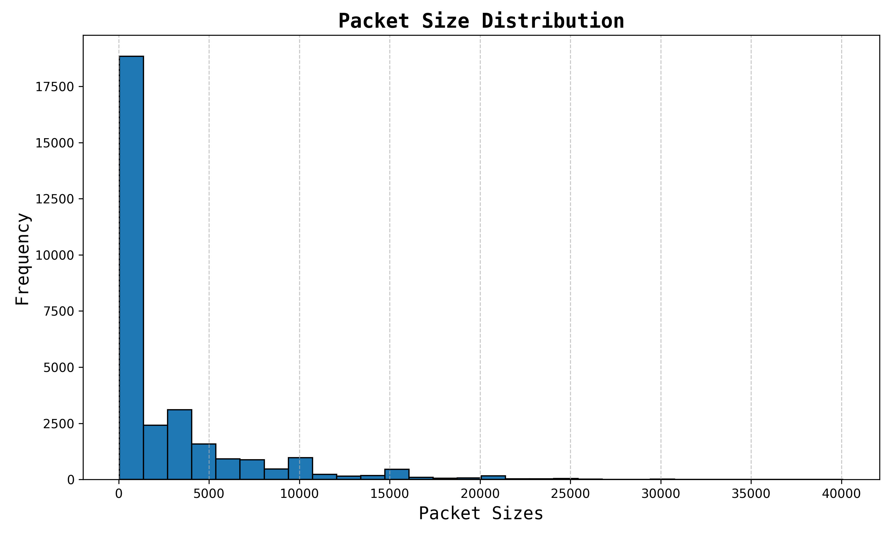
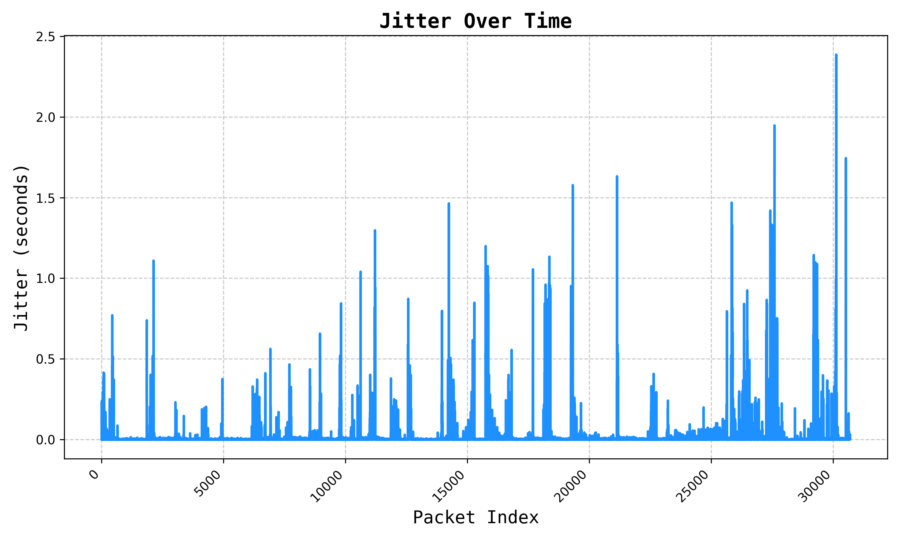
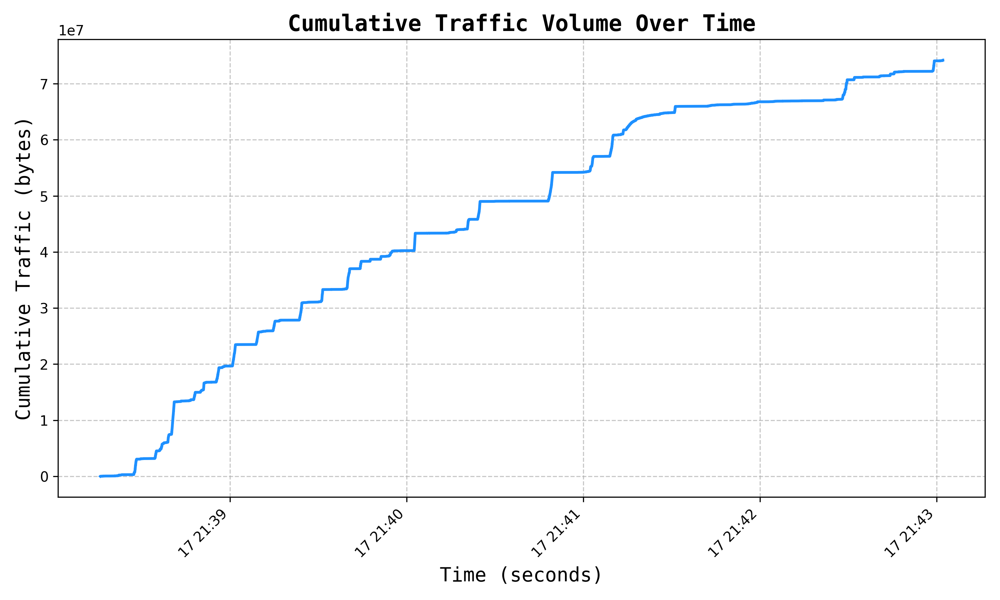
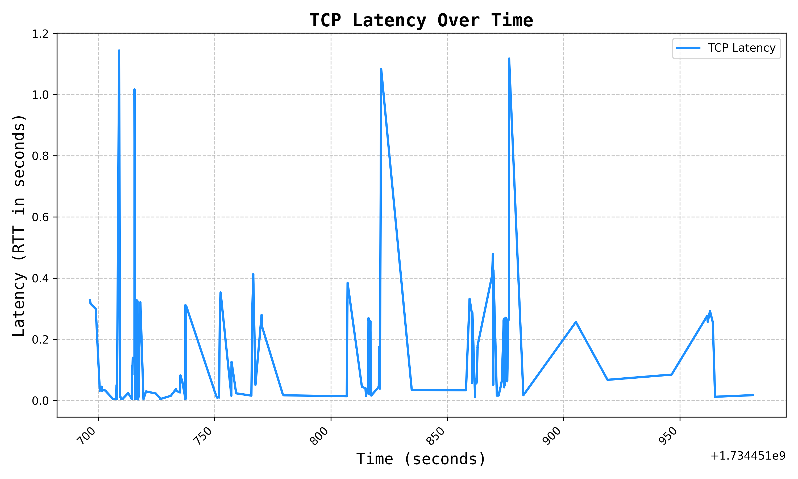

# arbor

A network analysis exercise using the Scapy library in python.

## Sample plots from a household Wi-Fi network

1. Throughput
   

2. Protocol Distribution
   

3. Packet Size Distribution
   

4. Jitter
   

5. Cumulative Traffic
   

6. TCP Latency
   
