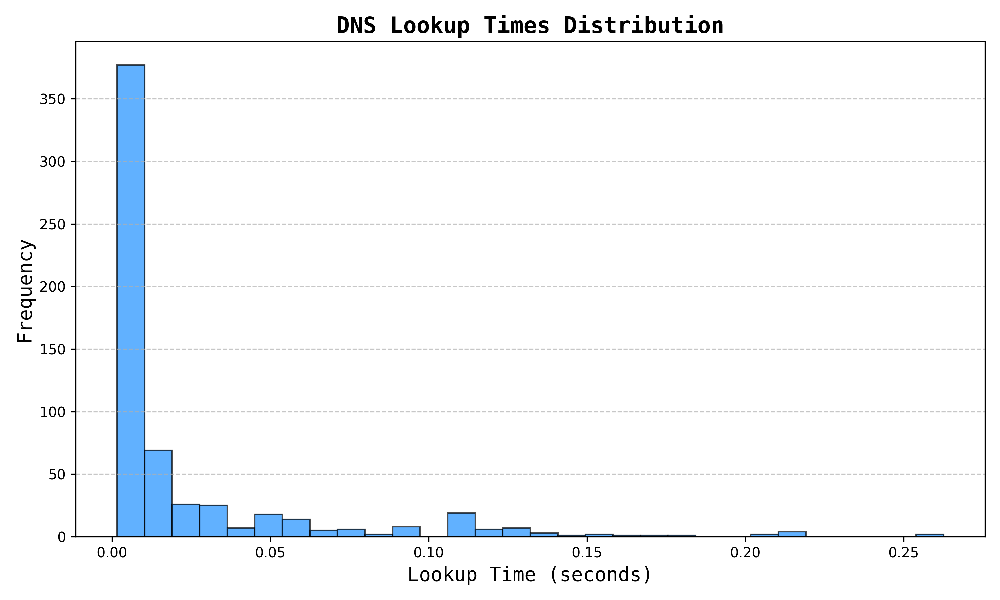

# arbor

A network analysis exercise using the Scapy library in python.

## Sample plots from a household Wi-Fi network

1. Throughput
   

2. Protocol Distribution
   

3. Packet Size Distribution
   

4. Jitter
   

5. Cumulative Traffic
   

6. TCP Latency
   

7. Distribution of DNS Lookup Times
   

## Reuse

If you wish to reuse this app:

1. Clone the repository
2. Create a virtual environment and install packages in `requirements.txt`
3. Execute main.py in one of two modes:
   - gather - Takes in two arguments: output (the name of the file or the path to which you want the capture to be saved). You may also specify a duration under the option `--duration` (default duration is 10s) (or)
   - analyze - Takes in a single argument: The path of the .pcap/.cap/.pcapng file that is to be analyzed and plotted.
4. The plots will be saved in a subdirectory inside this directory (`arbor`).

## Dependencies - Honorable mentions

1. `pyshark` - [repository](https://github.com/KimiNewt/pyshark/)
2. `scapy` - [repository](https://github.com/secdev/scapy)
3. `typer` - [repository](https://github.com/fastapi/typer)
4. `matplotlib` - [repository](https://github.com/matplotlib/matplotlib)
