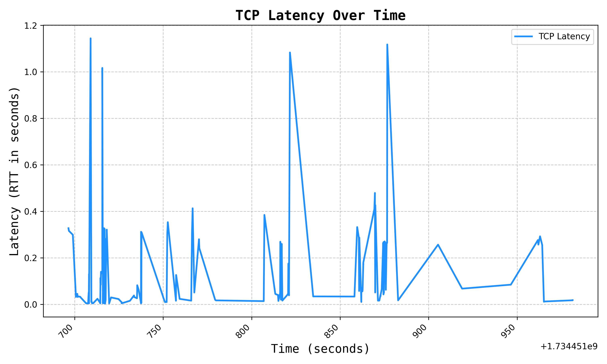

# Arbor: A Network Traffic Analysis and Visualization Tool

---

**Repository**: [github.com/themohitnair/arbor](https://github.com/themohitnair/arbor)

## Abstract

This report presents Arbor, an advanced open-source network traffic analysis tool implemented in Python. Arbor provides comprehensive network monitoring capabilities through packet capture and analysis, generating visualizations for seven critical network metrics: throughput, protocol distribution, packet sizes, jitter, cumulative traffic, TCP latency, and DNS performance. Built with Scapy and Matplotlib, Arbor supports real-time packet capture and historical PCAP file analysis, making it invaluable for network administrators and researchers seeking detailed insights into network performance. The tool’s modular and extensible design further enhances its adaptability for diverse use cases.

## Introduction

Network traffic analysis plays a vital role in understanding network behavior, troubleshooting issues, and optimizing performance. Although numerous commercial tools exist, they are often costly and lack customization. Arbor addresses these challenges by offering a robust and customizable open-source alternative. Designed as a command-line tool, Arbor integrates packet capture with in-depth metric analysis and visualization, providing a detailed overview of network performance. This paper outlines the design, implementation, and key features of Arbor, highlighting its practical applications and potential for future development.

## Technical Implementation

### Core Architecture

Arbor’s architecture revolves around two primary commands implemented using the Typer library for CLI functionality:

- **`gather`**: Facilitates live packet capture.
- **`analyze`**: Enables analysis of pre-captured PCAP files.

The following snippet illustrates the command structure:

```python
@app.command()
def gather(
    output: str = Argument(..., help="Path to save the captured .pcap file"),
    interface: str = Argument(..., help="Network interface to capture packets"),
    duration: int = Option(10, help="Duration in seconds for the packet capture"),
):
    capture = pyshark.LiveCapture(interface=interface, output_file=output)
    start_time = time.time()
    for packet in capture.sniff_continuously():
        if time.time() - start_time >= duration:
            break
    capture.close()

@app.command()
def analyze(pcap_file: str = Argument(..., help="Path to the .pcap file to analyze")):
    packets = rdpcap(pcap_file)
    # Analysis implementation
```

### Metric Analysis Implementation

Arbor focuses on seven key metrics, each providing unique insights into network performance:

#### 1. Network Throughput Analysis

Throughput measures the rate of data transfer over fixed intervals:

```python
def measure_throughput(packets: list[Packet], interval_duration: int = 1):
    timestamps = [packet.time for packet in packets]
    sizes = [len(packet) for packet in packets]
    start_time = min(timestamps)
    end_time = max(timestamps)

    interval_start = start_time
    throughputs = []
    intervals = []

    while interval_start <= end_time:
        bytes_in_window = sum(
            sizes[i] for i, timestamp in enumerate(timestamps)
            if interval_start <= timestamp < interval_start + 1
        )
        throughput_bps = (bytes_in_window * 8) / interval_duration
        throughputs.append(throughput_bps)
        intervals.append(datetime.fromtimestamp(float(interval_start)))
        interval_start += interval_duration
    return throughputs, intervals
```


#### 2. Protocol Distribution Analysis

Arbor examines the distribution of network protocols to identify usage patterns:

```python
def get_protocol_distribution(packets: list[Packet]):
    protocols_count = Counter()
    protocol_names = {
        1: "ICMP", 6: "TCP", 17: "UDP", 80: "HTTP",
        443: "HTTPS", 53: "DNS", 21: "FTP", 22: "SSH"
    }

    for pkt in packets:
        if pkt.haslayer("IP"):
            proto = pkt["IP"].proto
            protocol_name = protocol_names.get(proto, "Other")
            protocols_count[protocol_name] += 1
    return protocols_count
```


#### 3. Packet Size Distribution Analysis

Understanding packet size distribution provides insights into traffic types and potential issues:

```python
def get_packet_size_distribution(packets: list[Packet]):
    pkt_sizes = [len(pkt) for pkt in packets]
    return pkt_sizes
```


#### 4. Network Jitter Analysis

Jitter analysis evaluates variations in packet inter-arrival times, revealing stability issues:

```python
def measure_jitter(packets: list[Packet]):
    inter_arrival_times = [
        packets[i].time - packets[i - 1].time
        for i in range(1, len(packets))
    ]
    jitter_values = [
        abs(inter_arrival_times[i] - inter_arrival_times[i - 1])
        for i in range(1, len(inter_arrival_times))
    ]
    return jitter_values
```


#### 5. Cumulative Traffic Analysis

Cumulative traffic tracks the total data volume over time:

```python
def measure_cumulative_traffic(packets: list[Packet]):
    timestamps = [datetime.fromtimestamp(float(pkt.time)) for pkt in packets]
    sizes = [len(pkt) for pkt in packets]
    cumulative_traffic = [sum(sizes[:i + 1]) for i in range(len(sizes))]
    return timestamps, cumulative_traffic
```


#### 6. TCP Latency Measurement

TCP latency measures the round-trip time of SYN/SYN-ACK pairs:

```python
def measure_tcp_latency(packets):
    tcp_timestamps = []
    tcp_rtts = []
    outstanding_requests_tcp = {}

    for pkt in packets:
        if pkt.haslayer("TCP"):
            tcp_layer = pkt["TCP"]
            if tcp_layer.flags == "S":
                outstanding_requests_tcp[tcp_layer.seq] = pkt.time
            elif tcp_layer.flags == "SA":
                if tcp_layer.ack - 1 in outstanding_requests_tcp:
                    request_time = outstanding_requests_tcp.pop(tcp_layer.ack - 1)
                    latency = pkt.time - request_time
                    tcp_rtts.append(latency)
                    tcp_timestamps.append(pkt.time)

    return tcp_timestamps, tcp_rtts
```



#### 7. DNS Resolution Time Analysis

DNS analysis tracks query-response pairs to measure resolution times:

```python
def measure_dns_resolution_times(packets: list[Packet]):
    dns_queries = {}
    resolution_times = []

    for pkt in packets:
        if pkt.haslayer("DNS"):
            dns_layer = pkt["DNS"]
            if dns_layer.qr == 0:  # Query
                dns_queries[dns_layer.id] = pkt.time
            elif dns_layer.qr == 1:  # Response
                if dns_layer.id in dns_queries:
                    query_time = dns_queries.pop(dns_layer.id)
                    resolution_time = pkt.time - query_time
                    resolution_times.append(resolution_time)

    return resolution_times
```


### Visualization Implementation

Arbor’s visualization module ensures high-quality, consistent plots using Matplotlib. Below is an example:

```python
def plot_throughput(throughputs: list[int], intervals: list[datetime]):
    plt.figure(figsize=(10, 6))
    plt.plot(
        intervals,
        throughputs,
        label="Throughput",
        color="dodgerblue",
        linewidth=2,
        markersize=5,
    )
    plt.title(
        "Throughput Over Time",
        fontsize=16,
        fontweight="bold",
        fontname="monospace"
    )
    plt.xlabel("Time", fontsize=14, fontname="monospace")
    plt.ylabel("Throughput (bytes/sec)", fontsize=14, fontname="monospace")
    plt.grid(True, linestyle="--", alpha=0.7)
    plt.xticks(rotation=45, ha="right")
    plt.tight_layout()
    plt.savefig(os.path.join(PLOTS_DIR, "throughput.png"), dpi=300)
```

## Conclusion

Arbor demonstrates robust network analysis capabilities by seamlessly integrating packet capture, metric computation, and visualization. Key features include:

- Comprehensive metric coverage across seven critical network indicators.
- Modular architecture enabling extensibility and ease of use.
- Effective packet processing leveraging Scapy.
- High-quality visualizations powered by Matplotlib.
- Open-source nature encouraging community-driven improvements.

Arbor’s design makes it suitable for both educational and professional environments, with future potential for real-time visualizations and expanded protocol analysis. By bridging the gap between usability and functionality, Arbor provides a versatile solution for network traffic analysis.

---
